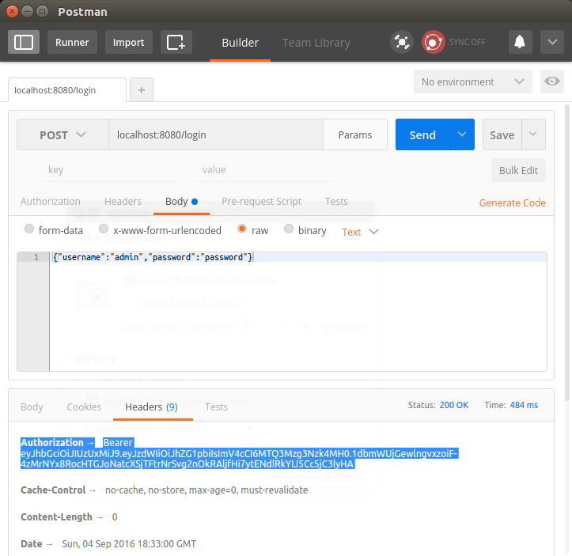
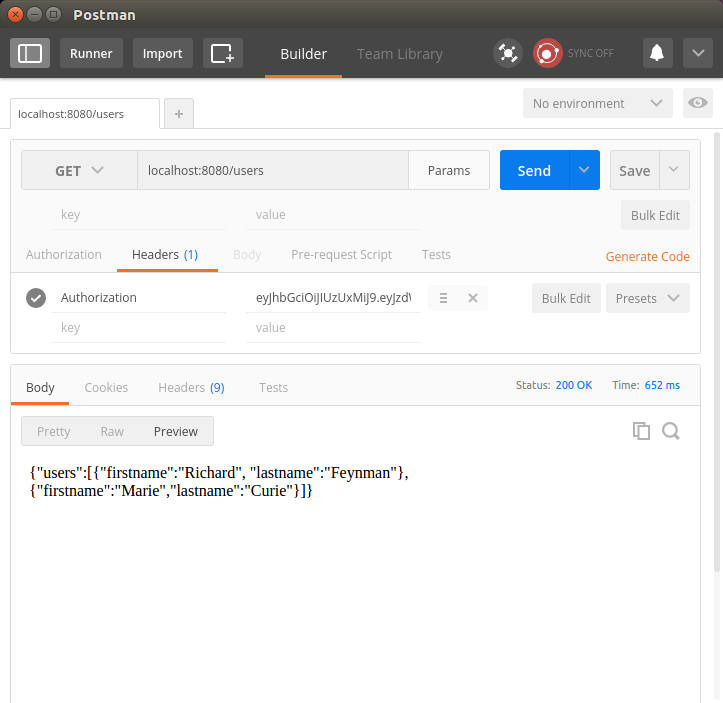

# 介绍
基于jwt协议的token，这个是十分方便的，所有的信息（加密，id，失效）都在token中，不需要额外存储token。并且我结合了spring-data-jpa，拥有了一定的权限认证。不过在权限认证上还不足，之后再调整吧。

# 使用之前

由于我集成了spring-data-jpa，所以在使用之前需要配置数据库

我在init目录中进行了初始化设置，所以会自动插入两个用户名。

# 如何使用

1. 先获得jwt的token
    
2. 再请求url
     

